# 🚀 ProjectSphere

> A Full-Stack Student Project Showcase Platform built with the MERN Stack.


## 🌐 Live Demo

### 🔗 Frontend
https://project-sphere-five.vercel.app/

### 🔗 Backend API
https://projectsphere-backend.onrender.com

---

# 📖 About Project

ProjectSphere is a modern platform where students can showcase their projects, collaborate with teammates, discover innovative ideas, and interact with other developers.

The platform provides authentication, project management, search functionality, comments, likes, bookmarks, invitations, notifications, analytics, and many other features that make it similar to a mini developer community.

The primary goal of ProjectSphere is to help students maintain an attractive portfolio while allowing recruiters, seniors, and fellow students to explore projects in an organized way.

---

# ✨ Features

## 👤 Authentication

- User Registration
- Secure Login
- Logout
- JWT Authentication
- Refresh Token Authentication
- HTTP Only Cookies
- Password Encryption using Bcrypt
- Protected Routes

---

## 👨‍💻 User Features

- Update Profile
- Upload Avatar
- Cloudinary Image Upload
- Recently Viewed Projects
- View Public Profiles

---

## 📁 Project Management

- Create Project
- Update Project
- Delete Project
- View Project Details
- Upload Thumbnail
- Upload Screenshots
- Add Technologies
- Add Tags
- Add GitHub Repository
- Add Live Demo Link
- Project Categories
- Difficulty Level
- Project Status

---

## 💬 Social Features

- Like Projects
- Comment on Projects
- Edit Comments
- Delete Comments
- Bookmark Projects
- Follow Users

---

## 🔍 Smart Search

Search projects using filters like:

- Title
- Technologies
- Tags
- Category
- Difficulty
- Creator

---

## 👥 Collaboration

- Invite Team Members
- Accept Invitation
- Reject Invitation
- Team Management

---

## 🔔 Notifications

Users receive notifications whenever important events occur, such as invitations or other supported actions.

---

## 📊 Analytics

Project statistics include:

- Total Likes
- Total Comments
- Total Views
- Project Performance

---

# 🛠️ Tech Stack

## Frontend

- React.js
- Vite
- Tailwind CSS
- Axios
- React Router DOM

---

## Backend

- Node.js
- Express.js
- MongoDB
- Mongoose
- JWT
- Bcrypt
- Multer
- Cloudinary
- Cookie Parser
- CORS

---

## Database

- MongoDB Atlas

---

## Deployment

Frontend:
- Vercel

Backend:
- Render

Media Storage:
- Cloudinary

Database:
- MongoDB Atlas

---

# 📂 Project Structure

```
ProjectSphere
│
├── client/
│   ├── src/
│   ├── components/
│   ├── pages/
│   ├── hooks/
│   └── assets/
│
├── controllers/
├── models/
├── routes/
├── middlewares/
├── utils/
├── config/
├── public/
├── app.js
├── server.js
└── package.json
```

---

# 🔐 Authentication Flow

```
User Login
      │
      ▼
Verify Credentials
      │
      ▼
Generate Access Token
      │
      ▼
Generate Refresh Token
      │
      ▼
Store Tokens in HTTP Only Cookies
      │
      ▼
Access Protected Routes
```

---

# ☁️ Deployment Architecture
```
User
  │
  ▼
Vercel (React Frontend)
  │
  ▼
Render (Express Backend API)
  │
  ├──────────────► Cloudinary
  │                    │
  │      Upload Image  │
  │◄───────────────────┘
  │     Returns Image URL
  │
  ▼
MongoDB Atlas
(Store Project Data + Cloudinary Image URLs)
```
---
# 📸 Screenshots

| Landing | Home |
|---------|------|
| 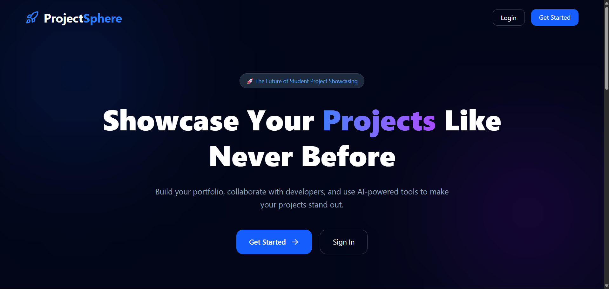 | 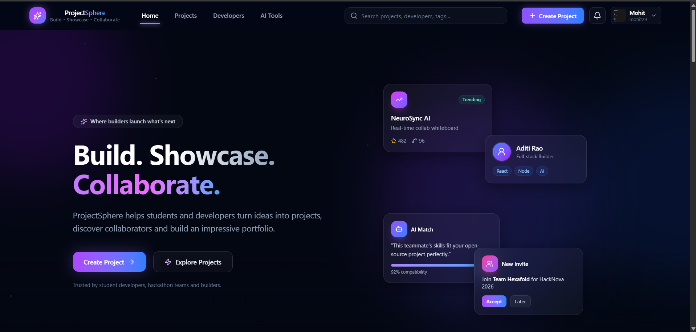 |

| Login | Create Account |
|-------|----------------|
| 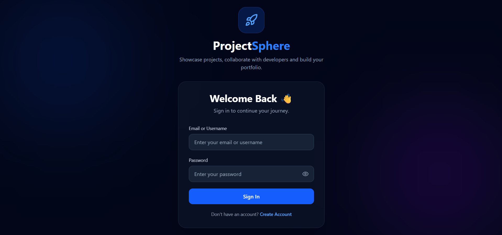 | 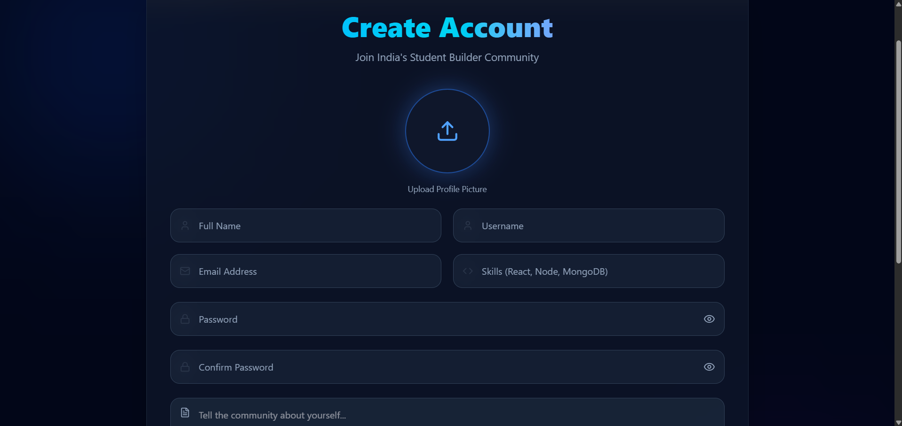 |

| Projects | Trending |
|----------|----------|
| 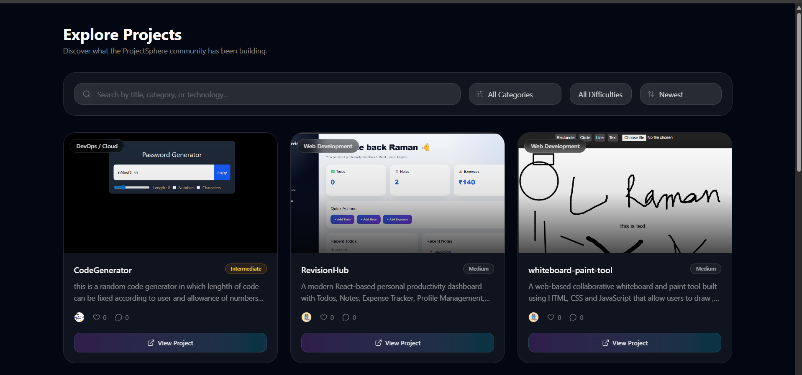 | 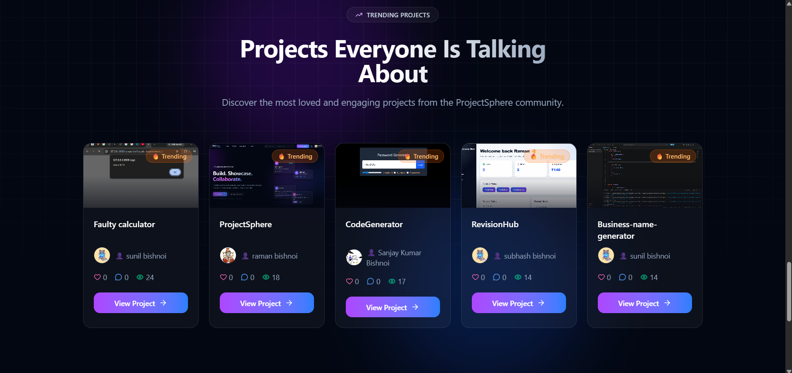 |

| Most Viewed | Developers |
|-------------|------------|
| 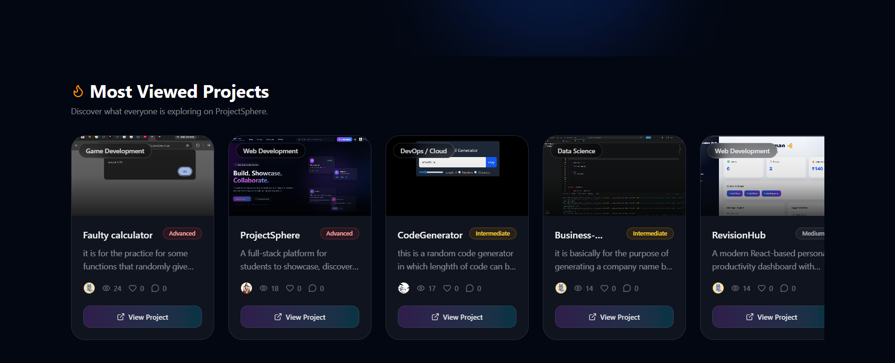 | 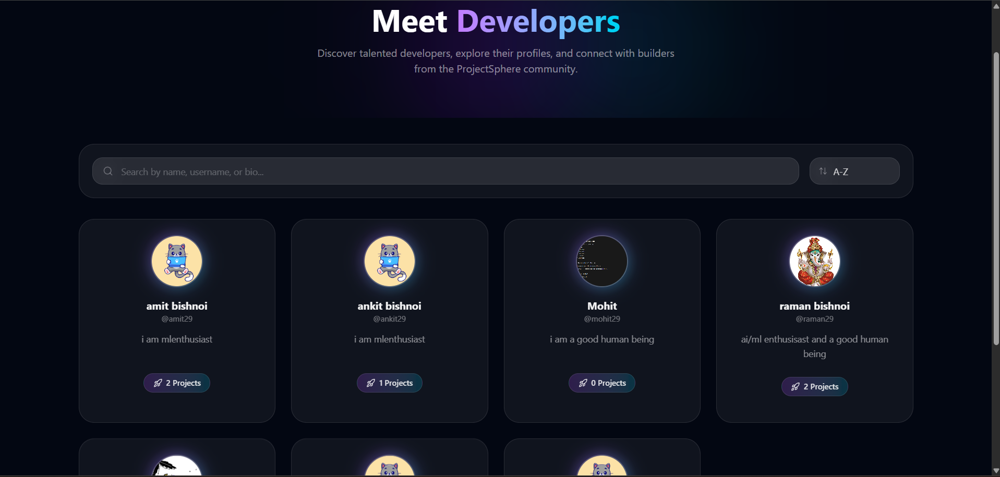 |

| AI Tools | Create Project |
|----------|----------------|
| 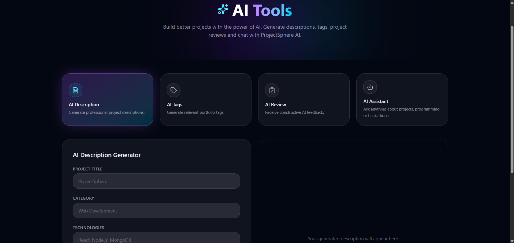 | 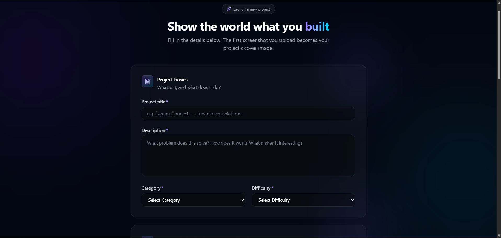 |

| Profile | Statistics |
|---------|------------|
| 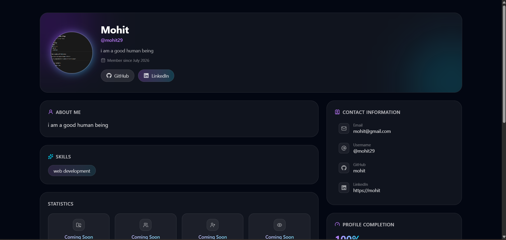 | 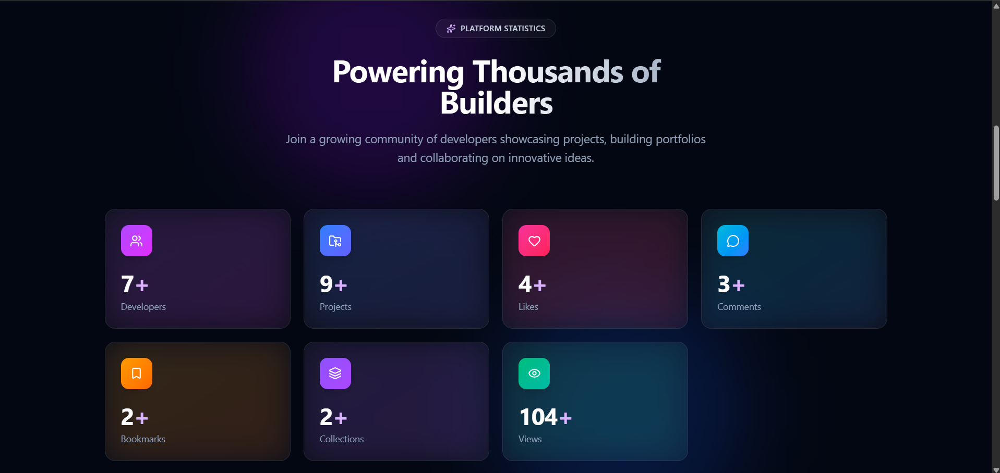 |

| Settings |
|----------|
| 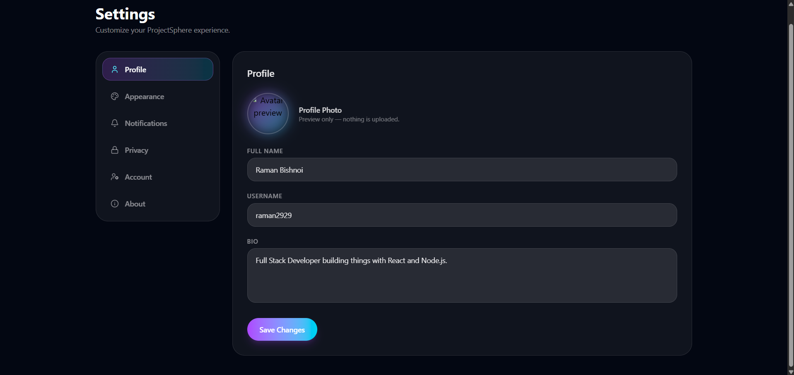 |

# 🚧 Challenges Faced During Development

Building ProjectSphere involved several real-world full-stack challenges that provided valuable learning experiences.

## 🔸 Authentication & JWT

One of the biggest challenges was implementing secure authentication using Access Tokens and Refresh Tokens while protecting user sessions with HTTP Only Cookies.

### Solution

- Implemented JWT Authentication
- Used Refresh Tokens
- Protected routes using middleware
- Stored tokens securely in HTTP Only Cookies

---

## 🔸 Cookie Issues

During development, cookies were not being received by the backend.

### Root Cause

Incorrect CORS configuration and browser cookie policies.

### Solution

- Configured CORS properly
- Enabled `credentials: true`
- Updated cookie settings
- Correctly handled cookies for production deployment

---

## 🔸 Cloudinary Uploads

Uploading project images and user avatars while deleting temporary files required careful handling.

### Solution

- Used Multer for uploads
- Uploaded images to Cloudinary
- Removed temporary local files after upload

---

## 🔸 MongoDB Relationships

Managing references between users, projects, comments, bookmarks, likes, and invitations became increasingly complex.

### Solution

Used Mongoose Object References along with `populate()` to efficiently fetch related data.

---

## 🔸 Search Functionality

Creating a flexible search system capable of filtering by multiple fields.

### Solution

Implemented dynamic MongoDB queries supporting multiple filters.

---

## 🔸 Deployment

Deploying frontend and backend separately introduced several production issues.

### Problems Encountered

- Frontend still pointing to localhost
- Backend API not reachable
- Environment variables missing
- CORS errors
- Cookie issues across different domains

### Solution

- Deployed frontend on Vercel
- Deployed backend on Render
- Updated frontend API URL
- Configured Render environment variables
- Fixed CORS configuration
- Connected frontend and backend successfully

---

# 📚 What I Learned

Through this project I gained practical experience in:

- Full Stack MERN Development
- REST API Design
- Authentication & Authorization
- MongoDB Data Modeling
- File Uploads
- Cloudinary Integration
- Deployment
- Environment Variables
- Debugging Production Issues
- CORS
- Cookie-Based Authentication
- Backend Architecture
- API Testing with Postman

---

# 🚀 Future Improvements

- AI Project Recommendation
- AI Project Description Generator
- Real-time Notifications
- Chat System
- Project Version History
- GitHub Repository Analysis
- Project Recommendation Engine
- Admin Dashboard
- Email Verification
- Password Reset
- Dark/Light Theme
- Progressive Web App (PWA)

---

# ⚙️ Installation

## Clone Repository

```bash
git clone https://github.com/yourusername/projectsphere.git
```

## Install Dependencies

Backend

```bash
npm install
```

Frontend

```bash
cd client
npm install
```

---

## Environment Variables

### Backend

```env
PORT=

MONGODB_URI=

ACCESS_TOKEN_SECRET=

REFRESH_TOKEN_SECRET=

ACCESS_TOKEN_EXPIRY=

REFRESH_TOKEN_EXPIRY=

CLOUDINARY_CLOUD_NAME=

CLOUDINARY_API_KEY=

CLOUDINARY_API_SECRET=

CORS_ORIGIN=
```

---

### Frontend

```env
VITE_API_URL=
```

---

## Run Backend

```bash
npm run dev
```

---

## Run Frontend

```bash
cd client
npm run dev
```

---

# 🌍 Live Links

Frontend

https://project-sphere-five.vercel.app/

Backend

https://projectsphere-backend.onrender.com

---

# 🤝 Contributing

Contributions are welcome!

Fork the repository, create a feature branch, commit your changes, and open a Pull Request.

---

# 📄 License

This project is licensed under the MIT License.

---

# ⭐ If you like this project

Give it a ⭐ on GitHub!

It motivates me to build more amazing full-stack applications.
